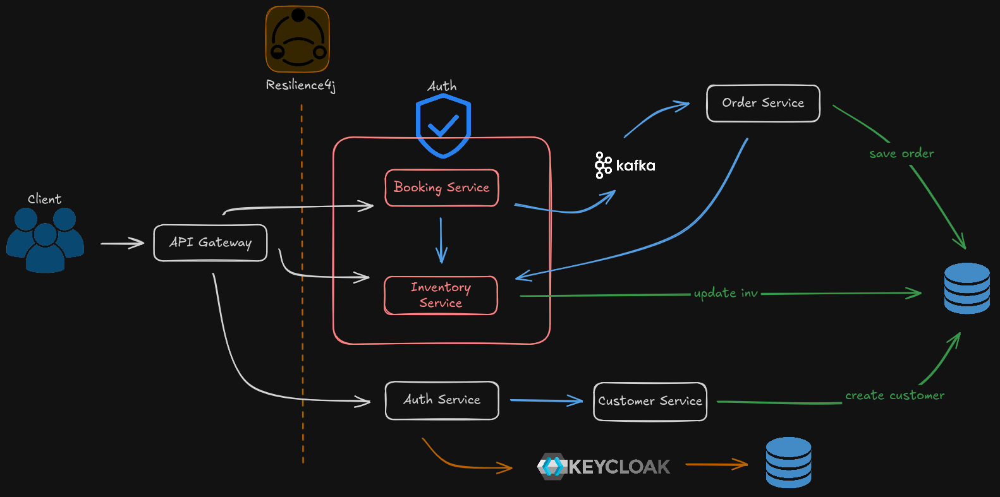

# FoodOrdering

A food ordering platform built as a set of independent Spring Boot microservices, fronted by an API Gateway, secured with Keycloak (OAuth2/JWT), and communicating asynchronously over Kafka.


## Architecture



**Request flow**
1. Clients authenticate through `auth-service`, which delegates identity to Keycloak and provisions a customer profile in `customerservice`.
2. All authenticated traffic enters through `api-gateway`, which validates the Keycloak-issued JWT and routes to the right downstream service.
3. `bookingservice` validates stock against `inventoryservice`, computes a receipt, and publishes a `BookingEvent` to Kafka instead of calling the order service directly.
4. `orderservice` consumes that event asynchronously and creates the order — decoupling booking from order fulfillment.

| Service | Port | Responsibility |
|---|---|---|
| `api-gateway` | 5000 | Single entry point; routes requests and validates JWTs |
| `auth-service` | 8086 | Registration/login; talks to Keycloak and `customerservice` |
| `customerservice` | 8079 | Customer profile storage |
| `inventoryservice` | 8080 | Restaurants, menus, stock levels (Flyway-managed schema) |
| `bookingservice` | 8081 | Validates stock, prices the order, emits `BookingEvent` |
| `orderservice` | 8082 | Consumes `BookingEvent` from Kafka, creates orders |

## Tech stack

- **Language & runtime** — Java 21, Gradle (Kotlin DSL)
- **Framework** — Spring Boot 4.1.0, Spring Cloud Gateway (WebMVC) 2025.1.2
- **Resilience** — Resilience4j circuit breakers on every gateway route, with dedicated fallback responses
- **API documentation** — springdoc-openapi (OpenAPI 3), aggregated into a single Swagger UI on the gateway
- **Security** — Spring Security, OAuth2 Resource Server (JWT validation), Keycloak 24 as the identity provider
- **Messaging** — Apache Kafka (Confluent Platform 7.5.0), Spring Kafka, Confluent Schema Registry
- **Persistence** — PostgreSQL, Spring Data JPA, Flyway migrations
- **Tooling** — Docker Compose, kafka-ui, Lombok
- **Architecture style** — Microservices with synchronous REST between services and event-driven communication (Kafka) between booking and order

## Getting started

### Prerequisites
- Docker & Docker Compose
- JDK 21
- (Optional) Gradle — each service ships the wrapper, so `./gradlew` is enough

### 1. Start the infrastructure

```bash
docker compose up -d
```

This brings up PostgreSQL (app DB + a separate Keycloak DB), Zookeeper, a Kafka broker, Schema Registry, kafka-ui and Keycloak.

| Tool | URL |
|---|---|
| Keycloak admin console | http://localhost:8090 (admin / admin) |
| kafka-ui | http://localhost:8084 |
| Schema Registry | http://localhost:8083 |
| PostgreSQL (app) | localhost:5432 |

### 2. Configure Keycloak

The realm isn't auto-imported — set it up once by hand in the admin console:

1. Log in at http://localhost:8090 with `admin` / `admin`.
2. Create a realm named `food-security-realm`.
3. Create a client:
   - **Client ID**: `auth-service`
   - **Client authentication**: On (confidential client)
   - **Authentication flow**: enable *Direct access grants*, enable *Service accounts roles*, disable *Standard flow* (no browser login is used — `auth-service` talks to Keycloak's token endpoint directly)
4. Under the `auth-service` client's **Service accounts roles** tab, assign the `realm-management` client roles `manage-users` and `view-users` — this lets `auth-service` create/delete Keycloak users via the Admin REST API during registration.
5. Copy the generated **Client secret** (Credentials tab) into `auth-service/src/main/resources/application.properties` as `keycloak.client-secret`.

With that in place, `auth-service` can register users (creates a Keycloak user + a `customerservice` profile, rolling back the Keycloak user if the profile creation fails) and log them in (password grant against Keycloak, returning a JWT that `api-gateway` validates on every downstream request).

### 3. Run the services

Each service is a standalone Spring Boot app:

```bash
./gradlew bootRun   # run from inside each service's directory
```

Start them in this rough order: `customerservice`, `inventoryservice`, `auth-service`, `bookingservice`, `orderservice`, `api-gateway`.

## Circuit breakers (Resilience4j)

Every downstream route in `api-gateway` (`auth-service`, `bookingservice`, `inventoryservice`) is wrapped in a named Resilience4j circuit breaker. On failure, the gateway forwards to a service-specific fallback route (`/fallbackRoute/auth`, `/fallbackRoute/booking`, `/fallbackRoute/inventory`) that returns a `503` with a clear message instead of a raw error. Live breaker state is available at `http://localhost:5000/actuator/circuitbreakers`.

Note: those fallback routes are internal forwards, so they pass back through Spring Security — they're explicitly `permitAll` in `SecurityConfig` alongside `/api/v1/auth/**`, otherwise an unauthenticated caller would get a `401` instead of the fallback response.

## API documentation (OpenAPI / Swagger)

`auth-service`, `bookingservice`, and `inventoryservice` each expose an OpenAPI spec at `/v3/api-docs` via springdoc-openapi. `api-gateway` proxies each of these through a dedicated route (`ApiDocsRoutes`) at `/api-docs/{service}` and aggregates them into a single Swagger UI, listed under `springdoc.swagger-ui.urls`.

Open http://localhost:5000/swagger-ui.html and pick a service from the dropdown to browse its endpoints.

Note: like the circuit-breaker fallback routes, `/swagger-ui.html`, `/swagger-ui/**`, `/v3/api-docs/**`, and `/api-docs/**` are `permitAll` in `SecurityConfig`, since these requests aren't authenticated.

## Inspecting Kafka via kafka-ui

kafka-ui isn't customized beyond what's in `docker-compose.yaml` — it's wired to the local broker (`KAFKA_CLUSTERS_BOOTSTRAPSERVERS=kafka-broker:29092`) with dynamic config enabled. To watch events flow between `bookingservice` and `orderservice`:

1. Open http://localhost:8084.
2. Go to **Topics** → `booking-events` to see the topic `bookingservice` publishes to and `orderservice` consumes from.
3. Use **Messages** on that topic to inspect individual `BookingEvent` payloads as they're produced.

Note: the Kafka broker has no persistent volume in this setup, so topics are recreated fresh (auto-created on first publish) every time the stack restarts — this is a local/dev setup, not meant to retain data across restarts.

## Notes

- Credentials and secrets in `application.properties`/`docker-compose.yaml` (DB passwords, the Keycloak client secret) are local-development values only — not meant for any real deployment.
